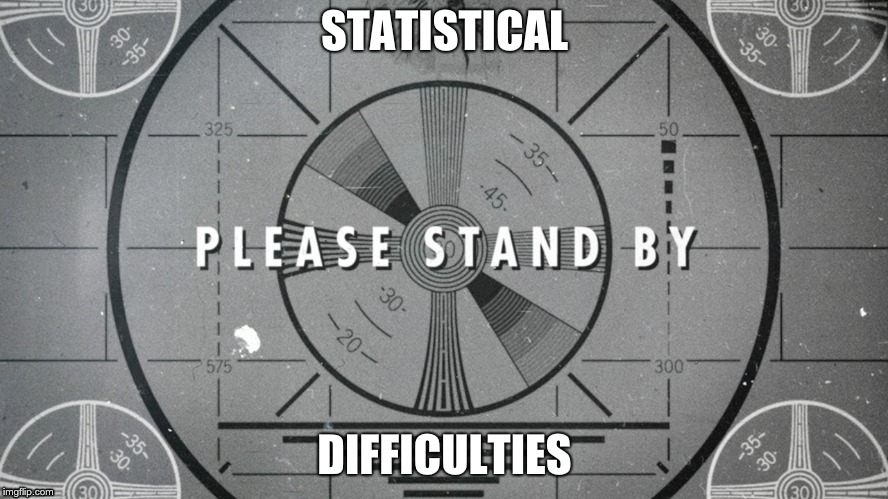

```{r setup, include = FALSE}
knitr::opts_chunk$set(echo = FALSE)
knitr::opts_chunk$set(cache=TRUE)
```

```{r load libraries, include = FALSE}
#install.packages( 'tidyverse' )
#install.packages( 'gee' )
#install.packages( 'survey' )
#install.packages( 'geepack' )

library( tidyverse, quietly=T, warn.conflicts = F )
library( gee, quietly=T, warn.conflicts = F )
library( geepack, quietly=T, warn.conflicts = F )
library( survey, quietly=T, warn.conflicts = F  )

```

```{r load data, include = FALSE}
data(ohio)

housing <- read.csv( "house_edu.csv", header=T )
housing <- housing[,-1]

api <- read.csv( "CaliAPIscore_master.csv", header=T )
api <- api[,-1]

api$charter_df <- ifelse( api$CHARTER_fact == 2, 1, 0 )
api$charter_ndf <- ifelse( api$CHARTER_fact == 1, 1, 0 )

api.districts <- api[which( api$RTYPE == "D" ),]

```

## What's wrong with linear regression?
\begin{exampleblock}{}
  {\large "Essentially, all models are wrong, but some are useful"}
  \vskip5mm
  \hspace\fill{\small--- George Box, \textit{Empirical Model-Building and Response Surfaces}, pg. 424}
\end{exampleblock}
\pause 
Other iterations:  

- "Remember that all models are wrong; the practical question is **how wrong do they have to be to not be useful**" (*Empirical Model-Building and Response Surfaces*, pg. 74)
- "The most that can be expected from any model is that it can supply **a useful approximation to reality**: All models are wrong; some models are useful" (*Statistics for Experimenters*, pg. 440) 

## What's wrong with linear regression?

- Regular linear regression assumes each datapoint is *independent* of each other
- What if we have multiple datapoints for each person/school/hospital/location we're measuring?

##
```{r stat difficulties, echo=FALSE, out.width='100%', fig.align="center"}

```

## Ordinary Least Squares (OLS)

- If we have data $\boldsymbol{X}$ and response $\vec{Y}$, we can find our regression coefficients through:

$$\boldsymbol{X}^T(\vec{Y} - \boldsymbol{X}\vec{\beta}) = 0$$

- Implement this using the `lm()` function

## Iteratively Reweighted Least Squares (IRLS)

-  Put a weight on the equation that estimates our coefficients
      - Accounts for the fact that we are no longer dealing with completely independent data points

$$\boldsymbol{X}^T\boldsymbol{W}(\vec{Y} - \boldsymbol{X}\vec{\beta}) = 0$$

- Implement this using the `gee()` function from the `gee` package
      - Can also use `lme()` from the `nlme` package, and `lmer()` from the `lme4` package


##
```{r end stat sidebar, echo=FALSE, out.width='200%', fig.align="center"}

```

## The `gee()` Function

- gee stands for Generalized Estimating Equation

Like with the lm() function, there are several arguments we need to fill in:

- **Formula**: this is the same formula you would plug in for lm(), of the form response ~ variable1 + variable2 + …
- **id**: this is a variable in your dataframe that identifies your clusters. If I have 12 patients with 3 datapoints each, each datapoint needs to have something that tells us which patient it is coming from. Usually this is done as the very first column of your dataframe, where the id can be a number or a string.
- **data**: like with lm(), this is the name of your dataframe
      
## The `gee()` Function

- **family**: the default for this argument is “gaussian”“, which just means Normal. We generally won’t put anything in for this argument unless we’re dealing with binary data (we’ll see this later).
- **corstr**: this tells the function how we want to do our weights.
      - There are 3 main options for this:
      1. “independence”: this is the default and will get us lm()
      2. “exchangeable”: this gives us random intercepts
      3. “AR-M”: this gives us random slopes and random intercepts. With this though, we also need to specify a “Mv” argument, which will be 1.
            
*\tiny{Side note: two other popular functions for modeling longitudinal data are lme() from the nlme package, and lmer() from the lme4 package. These work similarly to the gee() function but have slightly different synatx and technically require stronger statistical assumptions to use. I generally stick to gee().}*

## Example 1: Childhood Wheezing and Maternal Smoking

- Ohio dataset
      - `resp`: an indicator of wheeze status (1=yes, 0=no)
      - `id`: a numeric vector for subject id
      - `age`: a numeric vector of age, 0 is 9 years old
      - `smoke`: an indicator of maternal smoking at the first year of the study
- 537 unique subjects
- 2148 total observations

**Question: how does maternal smoking affect wheezing?**

## Example 2: Median Housing Value in Texas

- Housing dataset (select variables)
      - `countyID`: ID number for each county
      - `countyName`: Name of county
      - `yrsSince2009`: Number of years since 2009
      - `Median`: Median housing value in county
      - `totPop18plus`: Population 18 years or older
      - `BAtotPop18plus`: Population 18 years or older with at least a Bachelors
      - `BApctTotPop18plus`: Percentage of population 18 years or older with at least a Bachelors
      
- 53 unique counties
- 420 unique observaations
- 8 years of data

**Question: how does the percentage of Bachelors-holders in a distrct affect mean housing value?**

## Example 3: California API Scores

- API dataset (select variables)
      - `CDS`: County/District/School code
      - `RTYPE`: Record Type: (D=District, S=School, X=State)
      - `DNAME`: District name
      - `API`: Base API score
      - `PCT_AA`, `PCT_AS`, `PCT_HI`: Percentage of African American, Asian, and Hispanic students
      - `charter_df`: Indicator if record is is direct-funded charter
      - `charter_ndf`: Indicator if record is non direct-funded charter
      - `P_EL`: Percent English learners
      - `MEALS`: Percentage of Students Tested that are eligible for Free or Reduced Price Lunch Program

## Example 3: California API Scores

- 1047 unique school districts
- 7178 total observations
- 7 years of data

**Question: how does charter status affect district API score?**

## Slide with R Output

```{r cars, echo = TRUE}
summary(cars)
```

## Slide with Plot

```{r pressure}
plot(pressure)
```

